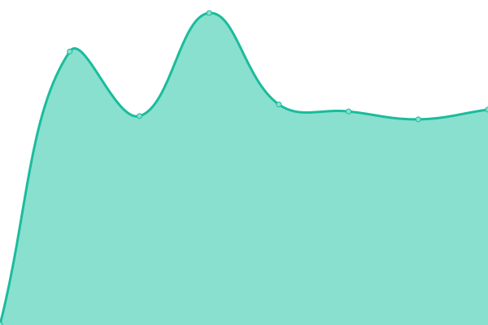

# [📈 Live Status](https://monetixio.github.io/upptime): <!--live status--> **🟧 Partial outage**

This repository contains the open-source uptime monitor and status page for [monetixio](https://monetixio.github.io/upptime), powered by [Upptime](https://github.com/upptime/upptime).

With [Upptime](https://upptime.js.org), you can get your own unlimited and free uptime monitor and status page, powered entirely by a GitHub repository. We use [Issues](https://github.com/monetixio/upptime/issues) as incident reports, [Actions](https://github.com/monetixio/upptime/actions) as uptime monitors, and [Pages](https://monetixio.github.io/upptime) for the status page.

<!--start: status pages-->
<!-- This summary is generated by Upptime (https://github.com/upptime/upptime) -->
<!-- Do not edit this manually, your changes will be overwritten -->
<!-- prettier-ignore -->
| URL | Status | History | Response Time | Uptime |
| --- | ------ | ------- | ------------- | ------ |
|  [Finance Monetix](https://api.finance.monetix.io/health) | 🟩 Up | [finance-monetix.yml](https://github.com/monetixio/upptime/commits/HEAD/history/finance-monetix.yml) | 

 545ms
     
 | 

<a href="https://monetixio.github.io/upptime/history/finance-monetix">100.00%</a>
    

|  [Dastafilez Monetix](https://api.room.monetix.io/health) | 🟩 Up | [dastafilez-monetix.yml](https://github.com/monetixio/upptime/commits/HEAD/history/dastafilez-monetix.yml) | 

 534ms
     
 | 

<a href="https://monetixio.github.io/upptime/history/dastafilez-monetix">100.00%</a>
    

|  [Bitlending Monetix](https://api.bitlending.monetix.io/health) | 🟥 Down | [bitlending-monetix.yml](https://github.com/monetixio/upptime/commits/HEAD/history/bitlending-monetix.yml) | 

 883ms
     
 | 

<a href="https://monetixio.github.io/upptime/history/bitlending-monetix">41.23%</a>
    

|  [Finance Staging Monetix](https://api.finance-staging.monetix.io/health) | 🟩 Up | [finance-staging-monetix.yml](https://github.com/monetixio/upptime/commits/HEAD/history/finance-staging-monetix.yml) | 

 513ms
     
 | 

<a href="https://monetixio.github.io/upptime/history/finance-staging-monetix">91.39%</a>
    

|  [Dastafilez Staging Monetix](https://api.room-staging.monetix.io/health) | 🟥 Down | [dastafilez-staging-monetix.yml](https://github.com/monetixio/upptime/commits/HEAD/history/dastafilez-staging-monetix.yml) | 

 0ms
     
 | 

<a href="https://monetixio.github.io/upptime/history/dastafilez-staging-monetix">0.00%</a>
    

|  [Bitlending Staging Monetix](https://api.bitlending-staging.monetix.io/health) | 🟥 Down | [bitlending-staging-monetix.yml](https://github.com/monetixio/upptime/commits/HEAD/history/bitlending-staging-monetix.yml) | 

 909ms
     
 | 

<a href="https://monetixio.github.io/upptime/history/bitlending-staging-monetix">45.47%</a>
    

<!--end: status pages-->

[**Visit our status website →**](https://monetixio.github.io/upptime)

## 📄 License

- Powered by: [Upptime](https://github.com/upptime/upptime)
- Code: [MIT](./LICENSE) © [monetixio](https://monetixio.github.io/upptime)
- Data in the `./history` directory: [Open Database License](https://opendatacommons.org/licenses/odbl/1-0/)
